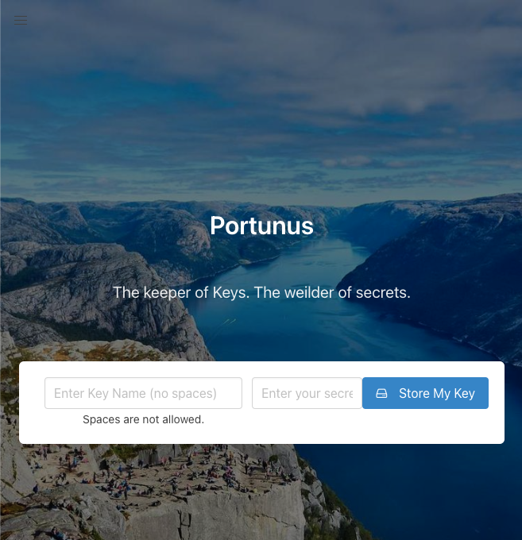

# 🔐 Secret API Key Manager

Welcome to **Portunus**, your ultimate solution for securely storing and managing API keys in frontend projects. Front end projects have the right to use 3rd party databases too!!
Are environmental variables not an option? No worries, we've got you covered!
Are you using Google Maps, Google Places, Food API's, Spotify data? Github won't like secret keys just hanging out for web crawlers.
No worries, hide your real key in a secure DB and build your shit. 

I created this project fro my students that don't have the skills to go server side yet but want to build fun shit that uses publically available data!!

##  Check it out
[](https://portunus-37606f126db8.herokuapp.com/)

## 🌟 Features

- **Secure Storage**: Uses MongoDB to safely store your secret API keys.
- **Easy Integration**: Effortlessly generate code snippets to retrieve keys in your frontend applications.
- **Safe Version Control**: Push your project without worrying about exposing sensitive data on platforms like GitHub, GitLab, or Bitbucket.

## 🚀 Getting Started using Portunus

1. Simply head over to [Keeper of Keys](https://aqueous-ocean-81489-d60197adbd3e.herokuapp.com/)
2. Use the simple form to name your key and add the value
3. Copy the auto generated fetch function with auto select (just click)
4. Paste the JS where you call your 3rd party resource (fetch) and pass the variable as your key.
5. Push your code and get paid. 💸

## 📚 Usage

1. **Add a New Secret Key**

   - Navigate to the web interface.
   - Enter the name and value of your secret key.
   - Click "Generated Code". ```ctrl+c``` and copy pasta baby

2. **Retrieve Secret Keys**

   - Copy the generated code snippet into your JS file where you call you API.
   - Use the provided function to access your API keys as local variables.

## 💡 Example

Here's how easy it is to integrate your secret keys:

```javascript
// In your Javascript file where you have you fetch or even Jquery $.ajax() method ... ewe
// Call this wherever you need your key.      
const {apiKey} = fetchKey('KeyName_ON_PORTUNUS');
console.log('Your super secret API Key is ready:', apiKey);
```
## 🚀 Build Your Own! Create your own key keeping dungeon
Yeah! Great idea you rockstar!
Welcome to the server side. 
Even though I store every key on Atlas encrypted so that it's super secure, you probably want to keep your data in your own DB. Don't get me wrong, you can park your ferrari at my house of you want.

### Prerequisites

- Node.js (v14.x or later)
- MongoDB (Ensure you have access to a MongoDB instance)

### Installation

1. **Clone the repository**

   ```bash
   git clone https://github.com/yourusername/secret-key-manager.git
   cd portunus
   ```

2. **Install dependencies**

   ```bash
   npm install
   ```

3. **Configure environment variables**

   Create a `.env` file in the root directory and fill out the following fields with your configuration details:

   ```plaintext
   MONGODB_URI=your_mongodb_connection_string
   PORT=3000
   SECRET_STRING=your_dogs_name
   ```

4. **Run the application**

   ```bash
   npm start
   ```

   Your application should now be running on `http://localhost:3000`.


## 📖 Documentation

You can find detailed documentation [here](https://github.com/djibba22/portunus/wiki) including API references and more advanced usage tips.

## 🤝 Contributing

Contributions are what make the open-source community such an amazing place. Feel free to fork the repo and submit a pull request or open an issue if you have any ideas or improvements. 

## 🛡️ License

This project is licensed under the MIT License. See the [LICENSE](LICENSE) file for more details.

## 🙏 Acknowledgments

- Special thanks to all contributors and testers.
- Thanks to the open-source community for inspiration and support.

## 📫 Contact

If you have any questions, feel free to reach out:

- GitHub: [@yourusername](https://github.com/yourusername)
- Email: your.email@example.com

---

Give **Secret Key Manager** a ⭐ on GitHub if you find it helpful! Secure your frontend secrets right from the start. 🛡️✨